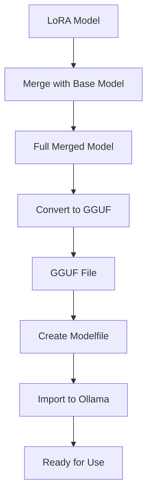

# 🦙 Comprehensive Ollama Setup Guide

## 🔄 **How the Process Works**

### **Step-by-Step Breakdown:**



### **1. LoRA Merging**
```python
# What happens:
base_model (Bielik-11B) + LoRA_adapter (your training) = merged_model (standalone)

# Parameters (currently hardcoded):
device_map="cpu"     # Uses CPU to avoid memory issues
torch_dtype="auto"   # Automatic precision
```

### **2. GGUF Conversion** 
```bash
# Converts to Ollama format:
merged_model → optimized_model.gguf

# Requires: llama.cpp converter
# Result: Smaller, faster model file
```

### **3. Modelfile Creation** (NOW CONFIGURABLE!)
```yaml
# Old (hardcoded):
temperature: 0.7      # ⚠️ Too high - caused hallucination
top_p: 0.9           # ⚠️ Too broad
repeat_penalty: 1.1   # ⚠️ Too weak

# New (configurable):
temperature: 0.3      # ✅ Conservative, quality-focused
top_p: 0.7           # ✅ More controlled
repeat_penalty: 1.3   # ✅ Strong anti-repetition
```

## 🎛️ **Parameter Configuration**

### **Available Presets:**

| Preset | Temperature | Top-P | Repeat Penalty | Best For |
|--------|-------------|-------|----------------|----------|
| **conservative** | 0.3 | 0.7 | 1.3 | Factual Q&A, avoiding hallucination |
| **balanced** | 0.5 | 0.8 | 1.2 | General conversation |
| **creative** | 0.7 | 0.9 | 1.1 | Creative explanations, brainstorming |

### **Usage Examples:**

```bash
# Conservative (default) - recommended for your cybernetics model
python3 setup_ollama.py --preset conservative

# Balanced mode
python3 setup_ollama.py --preset balanced

# Creative mode (use carefully)
python3 setup_ollama.py --preset creative

# Custom parameters
python3 setup_ollama.py --temperature 0.2 --top-p 0.6 --repeat-penalty 1.4

# Mixed: balanced preset + custom temperature
python3 setup_ollama.py --preset balanced --temperature 0.3
```

## 🚀 **Complete Setup Commands**

### **Basic Setup (Recommended):**
```bash
# Step 1: Setup with conservative parameters
python3 setup_ollama.py --model-path ./bielik-cybernetyka-lora --preset conservative

# Step 2: Test in Ollama
ollama run bielik-cybernetyka "Co to jest sprzężenie zwrotne?"

# Step 3: Use in Open WebUI
docker run -d -p 3000:8080 ghcr.io/open-webui/open-webui:main
# Open http://localhost:3000 and add model: bielik-cybernetyka
```

### **Advanced Setup Options:**
```bash
# Skip steps if already done
python3 setup_ollama.py --skip-merge --skip-convert

# Custom model name
python3 setup_ollama.py --model-name "cybernetyka-expert"

# Ultra-conservative (minimal hallucination)
python3 setup_ollama.py --temperature 0.1 --repeat-penalty 1.5
```

## 🛠️ **Troubleshooting**

### **Common Issues:**

**1. GGUF Conversion Fails:**
```bash
# Solution: Use online converter
# Go to: https://huggingface.co/spaces/ggml-org/gguf-my-repo
# Upload your merged model, download GGUF

# Then skip conversion:
python3 setup_ollama.py --skip-convert
```

**2. Memory Issues During Merge:**
```bash
# Already handled: uses CPU for merging
# If still issues, try:
export PYTORCH_CUDA_ALLOC_CONF=max_split_size_mb:512
```

**3. Model Hallucinates in Ollama:**
```bash
# Use more conservative settings:
python3 setup_ollama.py --temperature 0.1 --repeat-penalty 1.5
```

## 📊 **Parameter Impact Guide**

### **Temperature:**
- `0.1-0.3`: Very consistent, factual
- `0.4-0.6`: Balanced creativity/consistency  
- `0.7-1.0`: More creative, higher hallucination risk

### **Top-P:**
- `0.5-0.7`: Focused, predictable
- `0.8-0.9`: More variety
- `0.9-1.0`: Maximum diversity, unpredictable

### **Repeat Penalty:**
- `1.1-1.2`: Light anti-repetition
- `1.3-1.4`: Strong anti-repetition (recommended)
- `1.5+`: Very strong (may affect quality)

## 🎯 **Recommended Workflow**

1. **Start Conservative:**
   ```bash
   python3 setup_ollama.py --preset conservative
   ```

2. **Test Quality:**
   ```bash
   ollama run bielik-cybernetyka "Wyjaśnij homeostazę w cybernetyce"
   ```

3. **Adjust if Needed:**
   ```bash
   # If too rigid: increase temperature slightly
   python3 setup_ollama.py --temperature 0.4
   
   # If hallucinating: decrease temperature
   python3 setup_ollama.py --temperature 0.2
   ```

4. **Deploy to Open WebUI:**
   ```bash
   docker run -d -p 3000:8080 ghcr.io/open-webui/open-webui:main
   ```

## 🔍 **Quality Comparison**

### **Your Conversation Script vs Ollama:**
| Aspect | Conversation Script | Ollama Setup |
|--------|-------------------|--------------|
| Default Temperature | 0.3 ✅ | 0.3 ✅ (now fixed) |
| Streaming | Yes ✅ | No (Ollama handles this) |
| Parameter Control | Command line | Modelfile |
| Memory Usage | Loads full model | Optimized GGUF |
| Interface | Terminal | Web UI possible |

## 💡 **Pro Tips**

1. **Always use conservative preset** for cybernetics knowledge
2. **Test thoroughly** before deploying to Open WebUI
3. **Keep both conversation script and Ollama** - different use cases
4. **Monitor responses** and adjust parameters as needed
5. **Use lower temperature for factual questions**, higher for creative tasks

Your model should now behave consistently across both conversation script and Ollama! 🎉 